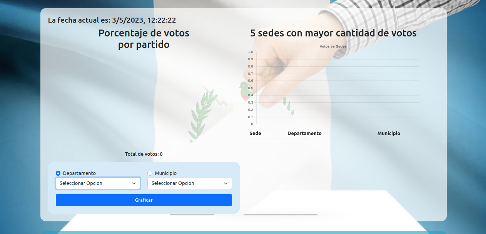
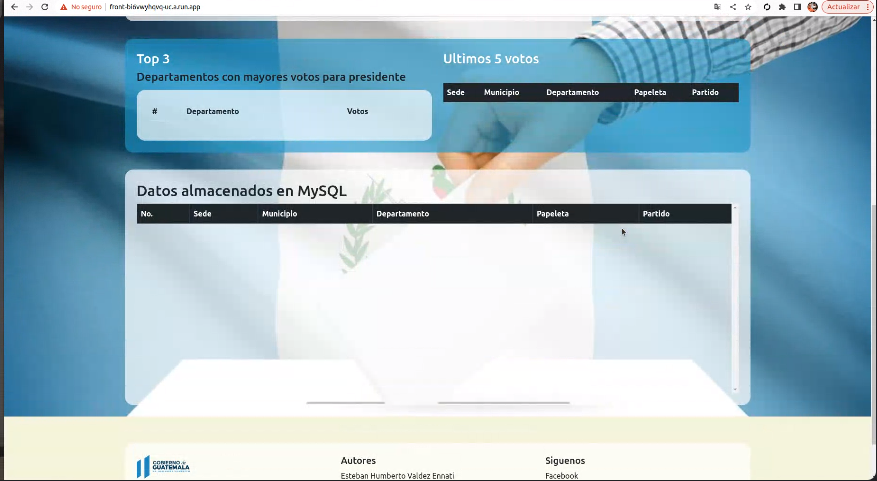
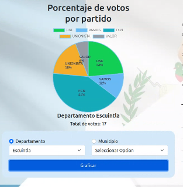
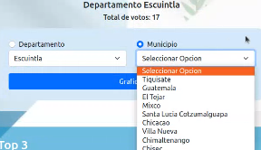
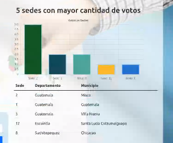
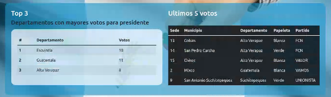
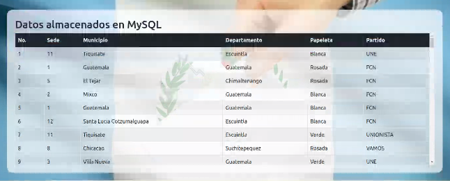
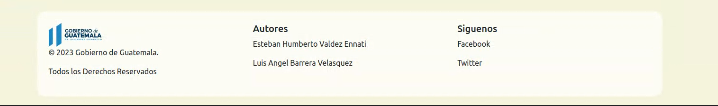

# Proyecto 1 :pencil:
# Manual De Usuario

UNIVERSIDAD DE SAN CARLOS DE GUATEMALA  
FACULTAD DE INGENIERÍA  
ESCUELA DE CIENCIAS Y SISTEMAS    
SISTEMAS OPERATIVOS 1 - SECCIÓN N

**Autores:**

**Esteban Humberto Valdez Ennati          &nbsp;&nbsp;&nbsp; &nbsp;&nbsp;&nbsp;&nbsp;&nbsp;&nbsp;        Carné: 202011535**

**Luis Angel Barrera Velásquez          &nbsp;&nbsp;&nbsp;&nbsp;&nbsp;&nbsp;&nbsp;&nbsp;&nbsp;&nbsp; &nbsp;&nbsp;&nbsp;&nbsp;&nbsp;&nbsp;        Carné: 202010223**

# Interfaz

La interfaz de este proyecto consiste en un sitio web desarrollado con React que muestra en tiempo real los datos cargados en la base de datos MySQL y en Redis. Ademas se muestra la fecha actual en la esquina superior izquierda.

La página principal o Dashboard de la aplicación contiene una variedad de datos y gráficos para proporcionar una vista general de las estadísticas de las elecciones. Los datos y gráficos que se mostrarán incluyen:

- __Gráfico circular del porcentaje de votos por partido__: este gráfico muestra el porcentaje de votos que cada partido ha recibido en cada municipio y departamento. Esto puede ser útil para identificar las preferencias de los votantes en diferentes áreas. 

Se puede seleccionar la clasificacion por departamento o municipio, y presionar en el boton graficar. Mostrara la cantidad de votos totales y cada uno de los porcentajes.

- __Gráfico de barras que muestre las 5 sedes con mayores votos almacenados en Redis__: este gráfico mostrará las cinco sedes con más votos almacenados en Redis. Esto puede ser útil para identificar las áreas donde se ha emitido la mayoría de los votos.

- __Top 3 de departamentos con mayores votos para presidente__: esto mostrará los tres departamentos con más votos emitidos para presidente.

- __Últimos 5 votos almacenados en Redis__: esto mostrará los últimos cinco votos emitidos y almacenados en Redis.

- __Recopilación de datos almacenados en MySQL__: muestra una tabla con los datos que estan guardados en la base de datos, se puede observar la informacion completa de cada uno de los votos.

Y finalmente tiene un Footer en el que se pueden observar los datos de los autores asi como los derechos, tambien puede encontrar las redes sociales para seguir el control de los votos.

